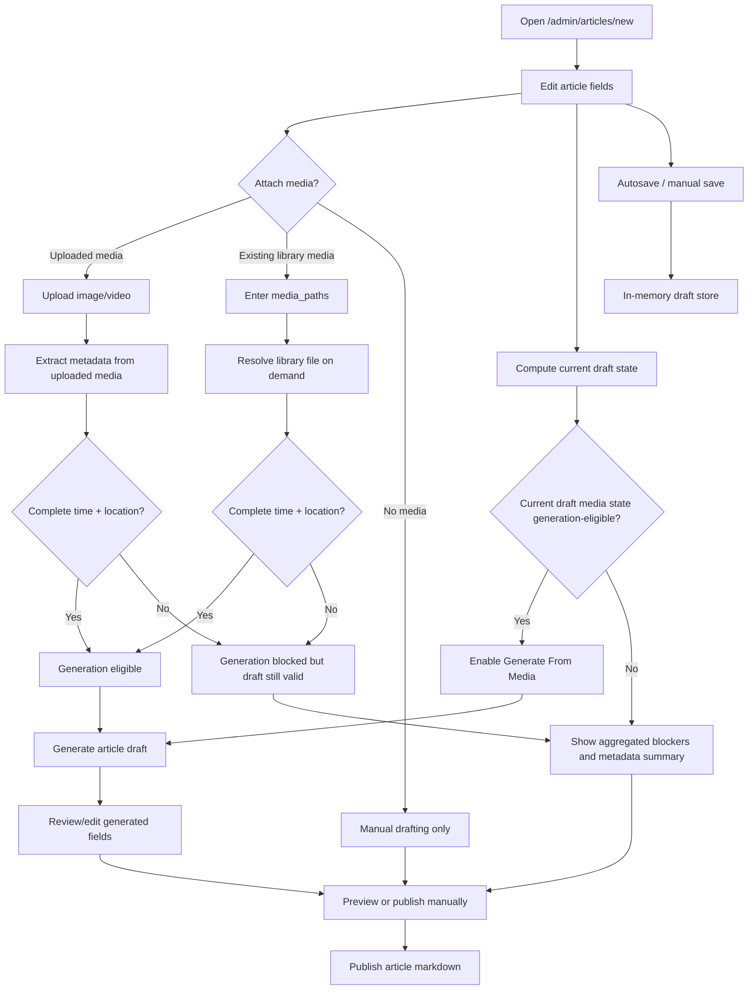
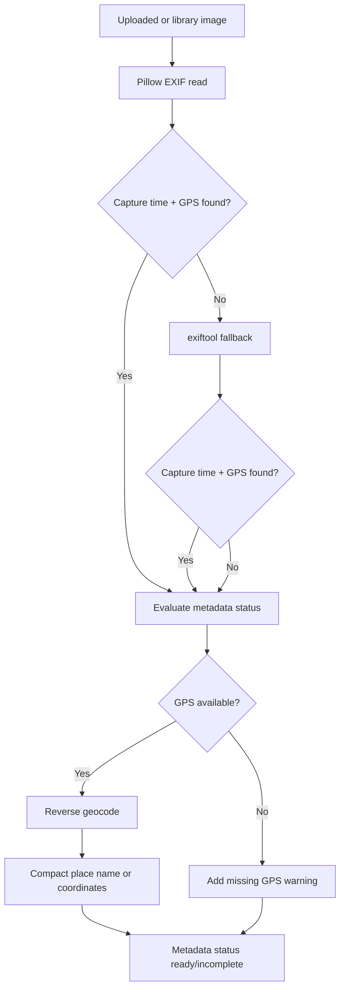
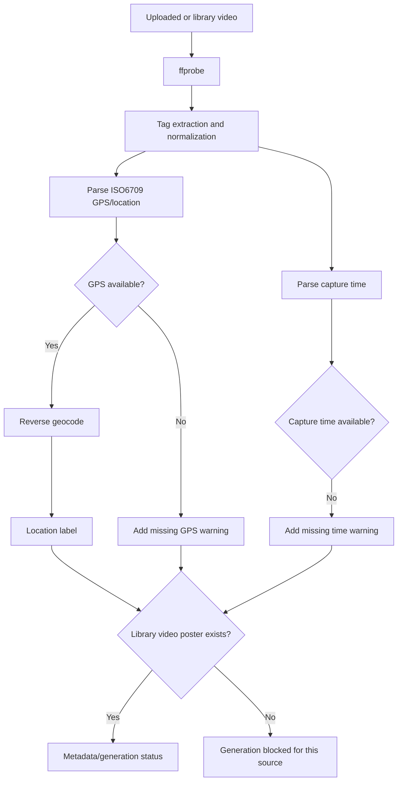
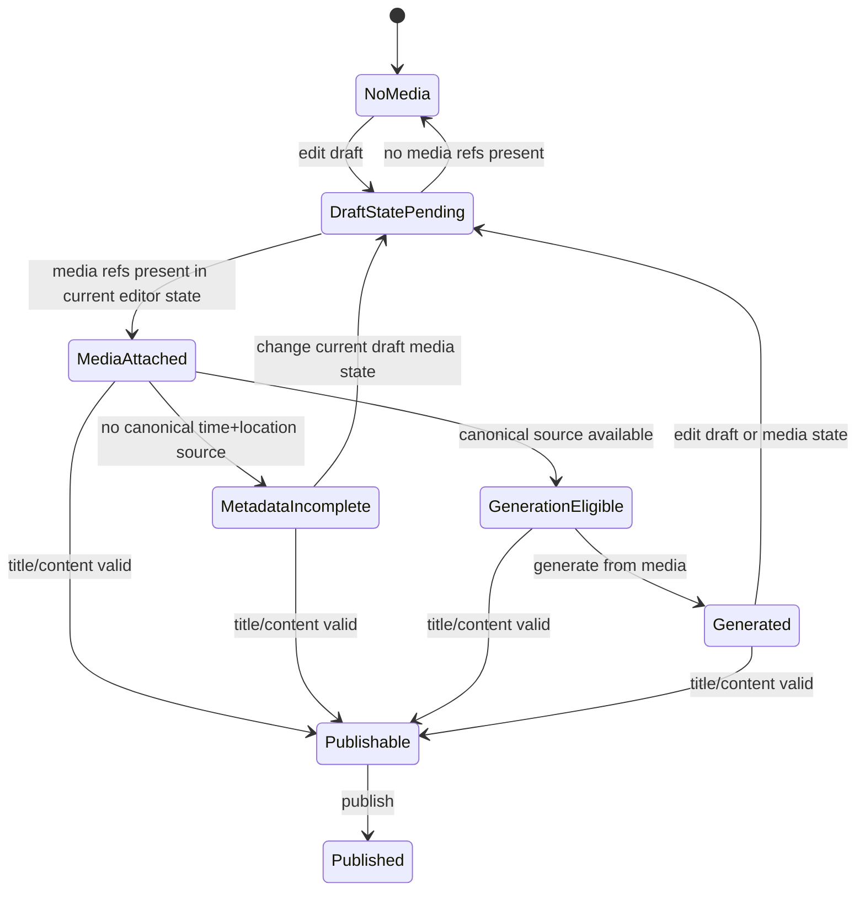
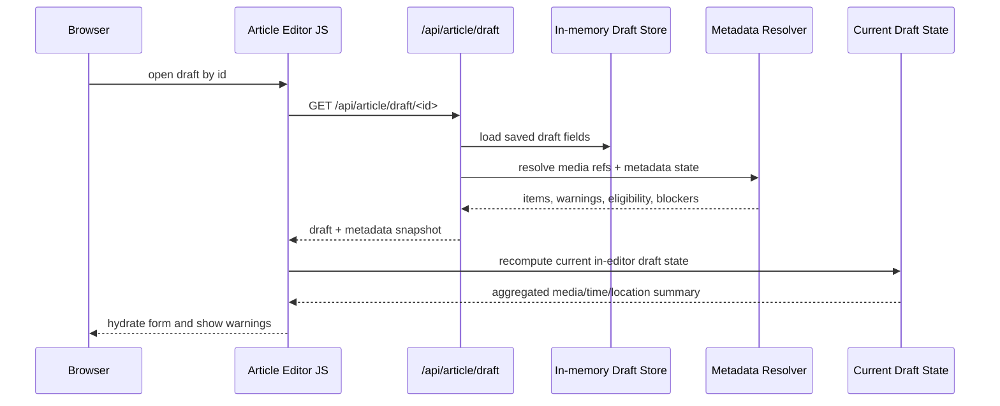
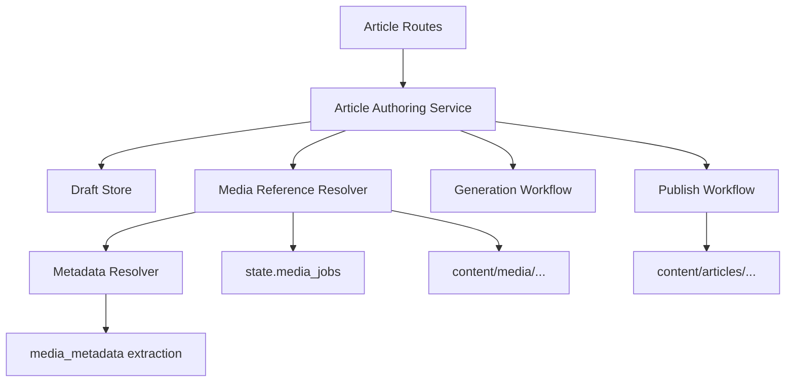

# Article Authoring Lifecycle

Last updated: March 17, 2026

## Purpose

This is the canonical design document for article creation, drafting, save/load, metadata-aware generation, preview, and publish inside `content_manager`.

Metadata is a first-order concern in this workflow:

- manual drafting and publish can proceed without complete metadata
- AI generation cannot
- save/load must preserve media references and re-evaluate metadata state on resume
- generation eligibility should be computed from the current in-progress draft state, not only the last saved draft snapshot

Important current caveat:

- Not all media in the library has complete metadata right now.
- See [media-metadata-coverage-status.md](./media-metadata-coverage-status.md).

## Current Lifecycle

The current authoring flow combines article fields, media references, metadata extraction, generation readiness, and publish behavior in one UI. The editing page should aggregate time/location/media descriptions into one visible draft-state summary.

### Current product truths

- Saving a draft does not require metadata completeness.
- Loading a draft must reconstruct media references and metadata state.
- The editing page should show an aggregated draft-state summary for media, location, and time.
- Generation requires at least one canonical source with usable capture time and usable location.
- Publish requires title/content and valid media references, not generation eligibility.

## Metadata Dependency Model

### Images

### Videos

### What counts as usable for generation

- a source must provide:
  - `captured_at`
  - `location_name`
  - `time_of_day`
- generation can use mixed sources, but one canonical source must satisfy all three
- metadata disagreements are warnings, not automatic failure
- existing-library video generation additionally requires a poster JPG

### Expected trouble categories

- partial or missing EXIF/QuickTime tags
- metadata stripped during export or prior conversion
- geocoder/network failure
- approximate or heuristic location labels
- missing poster JPG for existing-library videos
- disagreement between multiple sources
- local-time versus UTC capture-time ambiguity in video metadata

These are workflow constraints to design around, not just incidental bugs.

## Generation Eligibility State

Generation eligibility should depend on the current in-progress draft state:

- current uploaded job ids attached to the editor
- current `existing_media_paths` text in the editor
- current metadata availability for those references
- current blockers and warnings aggregated onto the editing page

It should not depend solely on whether the most recent autosave had a valid snapshot.

Key rule: `Publishable` does not depend on `GenerationEligible`.

## Draft Save/Load

Current draft payload fields:

- `title`
- `summary`
- `category`
- `tags`
- `thumbnail`
- `existing_media_paths`
- `content`
- `media_jobs`

Drafts are currently in-memory only, so media references may go stale across process restarts.

On resume, the app should reconstruct:

- draft fields
- uploaded and existing-library media references
- metadata status per media item
- generation eligibility
- stale-reference warnings
- aggregated media/time/location descriptions shown directly in the editing page

## Target Less-Coupled Architecture

### Boundaries

- routes parse HTTP and return responses
- article authoring service owns save/load/list/hydration/publish orchestration
- current draft state should be resolvable independently of draft persistence
- media reference resolver normalizes uploaded-job and library-path selections
- metadata resolver computes per-item status, warnings, blockers, and canonical source
- generation workflow handles OpenAI-specific generation
- publish workflow handles article assembly and writing

## Contracts

### `DraftArticle`

- article fields
- attached uploaded job ids
- attached existing media paths
- metadata snapshot
- updated time

### Metadata snapshot

- resolved media items
- generation eligibility
- blocking reasons
- canonical location/time context
- warnings
- aggregated media summary
- aggregated location summary
- aggregated time summary

### Validation split

- generation validation:
  - requires canonical metadata source
  - may fail while draft remains editable and publishable
- publish validation:
  - requires title/content
  - requires valid media references used for embed generation
  - does not require metadata completeness

## Related Docs

- [media-metadata-coverage-status.md](./media-metadata-coverage-status.md)
- [content-manager-architecture.md](./content-manager-architecture.md)
- [article-generation-contract.md](./article-generation-contract.md)
