# Audio Transcoding Pipeline — Technical Reference

A self-hosted audio transcoding service accessible from anywhere, built on Flask, nginx, Cloudflare Tunnel, and FFmpeg. The service is gated behind two layers of authentication and runs processing on a home machine while remaining reachable via a Squarespace-managed domain.

Hostname split for this project:
- Public blog/site: `www.eloise.rip`
- Audio upload/transcoding tool: separate app subdomain (planned as `admin.eloise.rip`, final hostname TBD)

## Progress

Last updated: February 28, 2026

Progress tracker (keep this section current as steps are completed):
- [x] Step 2 (Windows): install `cloudflared` via `winget` (`2025.8.1`)
- [x] Step 3: authenticate, create tunnel, and route DNS
  - Tunnel name: `audio-app`
  - Tunnel ID: `3c11812a-c895-4274-b17a-c32a7605e9c3`
  - Origin cert: `C:\Users\Admin\.cloudflared\cert.pem`
  - Tunnel credentials: `C:\Users\Admin\.cloudflared\3c11812a-c895-4274-b17a-c32a7605e9c3.json`
  - DNS route: `admin.eloise.rip` CNAME mapped to tunnel
- [x] Step 4: repo-local config created at `cloudflared/config.yml` and validated with `cloudflared tunnel --config ... ingress validate`
- [x] Step 5: nginx installed (`1.29.4`), repo config added (`nginx/audio-app.conf`), include added to nginx.conf, and `nginx -t` passed
- [x] Step 6: Cloudflare Access policy configured and verified (unauthenticated browser now prompts for Access login)
- [x] Step 7: Python deps installed in `.venv`, `voice_uploader/app.py` added, and Waitress verified on `127.0.0.1:8000` (`/health` and `/` returned `200`)
- [ ] Step 8: blocked in non-elevated shell (`cloudflared service install` requires Administrator / Service Control Manager access)
- [ ] Step 9: verify end-to-end from local + phone
- [x] Startup automation script added: `scripts/start-audio-pipeline.ps1`
- [x] Simple admin upload page implemented at `/admin/upload` with API routes in `voice_uploader/app.py`

---

## Table of Contents

1. [Progress](#progress)
2. [Architecture Overview](#architecture-overview)
3. [DNS and Domain Layer](#dns-and-domain-layer)
4. [Cloudflare Layer](#cloudflare-layer)
5. [Home Machine Layer](#home-machine-layer)
6. [Authentication Flow](#authentication-flow)
7. [File Upload and Processing Flow](#file-upload-and-processing-flow)
8. [Component Reference](#component-reference)
9. [Setup Guide](#setup-guide)
10. [Directory Structure](#directory-structure)
11. [Configuration Reference](#configuration-reference)
12. [Admin Upload Page Notes](#admin-upload-page-notes)

---

## Two separate systems

This project has two completely independent components that share a git repository but are deployed and hosted separately:

- **`eloise.rip` (public site)** — static HTML/CSS/JS built by Pelican and deployed to **GitHub Pages**. The voice recorder page lives here. There is no server component; everything runs in the browser. Flask is never involved.
- **`admin.eloise.rip` (admin upload tool)** — a local Flask/Waitress app for uploading voice clips, transcoding them with FFmpeg, and pushing results to the repo. It is exposed remotely via **Cloudflare Tunnel**. It has no connection to the public site except that both live in the same repository.

The rest of this document describes the admin upload pipeline only.

---

## Architecture Overview

The upload pipeline is composed of four logical layers. A request from a phone on a mobile network travels through all four before any data is processed, and the response travels back the same path in reverse.

```mermaid
graph TD
    Phone["📱 Phone / Browser\n(anywhere in the world)"]
    CF["☁️ Cloudflare Edge\nDDoS protection, TLS termination,\nAccess authentication"]
    Tunnel["🔒 Cloudflare Tunnel\nEncrypted outbound connection\nfrom home machine to Cloudflare"]
    nginx["🔁 nginx\nReverse proxy on localhost"]
    Flask["🐍 Flask App\nUpload handling, job tracking"]
    FFmpeg["⚙️ FFmpeg Worker\nBackground thread\nAudio transcoding"]
    FS["💾 Filesystem\nmedia-source/  content/media/voice/"]

    Phone -->|"HTTPS — public internet"| CF
    CF -->|"Cloudflare Access checks\nemail allowlist"| Tunnel
    Tunnel -->|"HTTP on localhost:5000\n(TLS handled by Cloudflare)"| nginx
    nginx -->|"Proxy to Flask"| Flask
    Flask -->|"Spawns background thread"| FFmpeg
    FFmpeg -->|"Reads/writes"| FS
    Flask -->|"Reads/writes"| FS
```



The key architectural insight is that **no inbound port needs to be opened on your router**. The `cloudflared` agent on your home machine makes an outbound connection to Cloudflare's edge, and Cloudflare forwards traffic back through that persistent tunnel. This means your home IP address is never exposed, and your ISP's dynamic IP changes are irrelevant.

### Hostname plan

- `www.eloise.rip` — public blog/content site, served by GitHub Pages (no Flask).
- `admin.eloise.rip` — admin upload app, routed through Cloudflare Access and Tunnel to the local Flask process.

Only the admin subdomain routes through this upload pipeline.

---

## DNS and Domain Layer

Your domain is registered through Squarespace. To use Cloudflare for tunneling, you delegate DNS management to Cloudflare while keeping the domain registered at Squarespace. This is a standard and supported configuration — Squarespace continues to bill you for the domain, but all DNS records are managed in Cloudflare's dashboard.

```mermaid
graph LR
    Registrar["🟦 Squarespace\nDomain Registrar\n(billing stays here)"]
    NS["🌐 Nameservers\nChanged to Cloudflare's\nns1.cloudflare.com\nns2.cloudflare.com"]
    CFDNS["☁️ Cloudflare DNS\nManages all records\nfor yourdomain.com"]
    Tunnel["🔒 CNAME Record\nadmin.eloise.rip (example)\n→ tunnel-id.cfargotunnel.com"]

    Registrar -->|"Nameserver delegation"| NS
    NS --> CFDNS
    CFDNS --> Tunnel
```



### What this means practically

After you update the nameservers at Squarespace, any DNS record you add or change happens in the Cloudflare dashboard, not Squarespace. Cloudflare automatically creates the CNAME record pointing your chosen subdomain at the tunnel when you run `cloudflared tunnel route dns`. You never touch Squarespace DNS settings again for this subdomain.

Propagation after changing nameservers typically takes 24–48 hours, though it is often faster. You can check progress with `dig NS yourdomain.com` — when you see Cloudflare's nameservers in the response, the delegation is complete.

---

## Cloudflare Layer

Cloudflare sits between the public internet and your home machine. It performs three distinct roles: TLS termination (so your home machine never needs to manage certificates), DDoS protection, and access control via Cloudflare Access.

```mermaid
graph TD
    Internet["🌐 Public Internet Request\nhttps://admin.eloise.rip/upload (example)"]

    subgraph Cloudflare Edge
        TLS["TLS Termination\nCloudflare holds the certificate\nand decrypts HTTPS here"]
        Access["Cloudflare Access\nChecks for valid CF Access JWT\nin cookie or header"]
        AllowList{"Email in\nallowlist?"}
        LoginPage["Cloudflare-hosted\nLogin Page\nSend one-time code to email"]
        Forward["Forward request\nthrough tunnel"]
    end

    Internet --> TLS
    TLS --> Access
    Access --> AllowList
    AllowList -->|"No — first visit\nor session expired"| LoginPage
    LoginPage -->|"User enters OTP\nfrom email"| AllowList
    AllowList -->|"Yes"| Forward
    Forward -->|"HTTP (not HTTPS)\nover encrypted tunnel"| Home["🏠 Home Machine"]
```



### Cloudflare Access in detail

Cloudflare Access is a Zero Trust access layer. When a user visits your subdomain for the first time, Cloudflare intercepts the request before it reaches your machine and presents its own login page. The user enters their email address, and Cloudflare sends a one-time code to that address. If the email is on your Access policy allowlist, the code works and Cloudflare sets a JWT cookie in the browser. Subsequent requests carry this cookie and skip the login screen until the session expires (configurable, default 24 hours).

This happens entirely within Cloudflare's infrastructure — your home machine sees no traffic from unauthenticated users at all. The JWT that Cloudflare sets contains the verified email address, which it forwards to your app in the `Cf-Access-Authenticated-User-Email` header on every request. Flask reads this header to establish its own session without showing a second login form.

---

## Home Machine Layer

Once a request passes Cloudflare Access and travels through the tunnel, it arrives at your home machine as a plain HTTP request on `localhost:5000` (or whichever port `cloudflared` is configured to forward to). nginx sits in front of Flask as a reverse proxy, adding buffering, request size enforcement, and the ability to serve some content directly without hitting Python at all.


### Why nginx in front of Flask?

Flask's built-in development server is single-threaded and not hardened for production. nginx provides several things Flask doesn't handle well on its own: it buffers slow client uploads so Flask's thread isn't blocked waiting for a mobile connection to finish sending a file; it enforces request size limits at the network layer before data reaches Python; and it can serve truly static assets (CSS, JS, images) from disk without ever waking up the Python process. For a personal tool this distinction matters less, but it's good practice and costs nothing.

---

## Authentication Flow

There are two authentication layers. They work in sequence, and each has a distinct responsibility.

```mermaid
sequenceDiagram
    actor Phone as 📱 Phone
    participant CF as Cloudflare Access
    participant Flask as Flask App
    participant Session as Browser Session Cookie

    Phone->>CF: GET https://admin.eloise.rip/
    CF->>CF: Check for valid CF Access JWT cookie
    alt No valid JWT (first visit or expired)
        CF->>Phone: Show Cloudflare login page
        Phone->>CF: Submit email address
        CF->>Phone: Send one-time code via email
        Phone->>CF: Submit OTP code
        CF->>Phone: Set CF_Authorization cookie (JWT, 24h)
    end
    CF->>Flask: Forward request with Cf-Access-Authenticated-User-Email header
    Flask->>Flask: Read header, check email against ALLOWED_EMAILS
    alt Email on allowlist, no Flask session yet
        Flask->>Session: Set session["user"] = verified_email
    end
    alt No Flask session and not on allowlist
        Flask->>Phone: 302 Redirect to /login (fallback for direct local access)
    end
    Flask->>Phone: Serve requested page
```



The fallback `/login` route exists for local development only, where there is no Cloudflare in front of Flask. In production, Cloudflare Access has already verified the user before any request reaches Flask, so the Flask login form is never shown.

---

## File Upload and Processing Flow

Because audio transcoding takes non-trivial time, the upload and processing flow is asynchronous. The phone's HTTP connection returns immediately after the file is saved, and a background thread handles the FFmpeg work. The browser then polls a status endpoint until the job completes.


### Why not block on the upload?

Mobile connections are unreliable. If FFmpeg takes 30 seconds and the phone's connection drops or times out at 25 seconds, the browser would show an error even though the work completed successfully. By returning the job ID immediately and polling separately, the phone can be briefly disconnected and reconnect to check status without losing the result.

---

## Component Reference

### cloudflared

The `cloudflared` binary runs as a system service on your home machine. It maintains a persistent, encrypted outbound WebSocket connection to Cloudflare's edge network. When a request arrives at Cloudflare for your tunnel's hostname, Cloudflare sends it down this connection to `cloudflared`, which forwards it to the local service specified in your config (nginx or Flask directly).

`cloudflared` handles reconnection automatically if the connection drops. Running it as a `systemd` service means it restarts if it crashes and starts automatically on boot, so you never need to think about it.

### nginx

nginx runs on the home machine and listens on the port that `cloudflared` forwards to. Its configuration for this use case is minimal: proxy all requests to Flask on a different local port, set appropriate headers so Flask knows the real client IP and protocol, and optionally serve `/static/` files directly from disk.

### Flask

Flask is the application layer for the admin upload tool. It handles the upload endpoint, job tracking, and spawning FFmpeg subprocesses. It runs on `localhost:8000` (not exposed externally — nginx is the only thing that talks to it from outside).

Flask does **not** serve the public site or the voice recorder page. Those are static files deployed to GitHub Pages by a separate pipeline.

### FFmpeg

FFmpeg runs as a subprocess spawned by Python's `subprocess.run()`. The Flask code calls FFmpeg with the input path (saved `.qta` file) and output path (`content/media/voice/MM-DD.m4a`). The full stderr output from FFmpeg is captured and stored in the job record so you can see what went wrong if a transcode fails.

### Pelican

Pelican is **not part of this pipeline**. It builds the public static site (including the voice recorder page) and its output is deployed to GitHub Pages. The two systems share a git repository but are otherwise completely independent.

---

## Setup Guide

### Step 1 — Transfer DNS to Cloudflare

Log in to [cloudflare.com](https://cloudflare.com), add your domain, and copy the two nameserver hostnames Cloudflare gives you. Then log in to Squarespace, go to Domains → your domain → DNS Settings, and replace the existing nameservers with Cloudflare's. Save and wait for propagation (up to 48 hours, usually less).

### Step 2 — Install cloudflared

```powershell
# Windows
winget install --id Cloudflare.cloudflared -e

# Verify
cloudflared --version
```

### Step 3 — Create the tunnel

```bash
# Authenticate cloudflared with your Cloudflare account (opens browser)
cloudflared tunnel login

# Create a named tunnel — generates a credentials JSON file
cloudflared tunnel create audio-app

# Note the tunnel ID printed in the output, you need it for the config file

# Create a DNS CNAME record pointing your admin app subdomain at the tunnel
cloudflared tunnel route dns audio-app admin.eloise.rip
```

### Step 4 — Write the cloudflared config

Create a repo-local config file at `cloudflared/config.yml` (example absolute path on this machine: `C:\Users\Admin\eloise.rip\eloise.rip\cloudflared\config.yml`):

```yaml
tunnel: <your-tunnel-id>
credentials-file: C:\Users\Admin\.cloudflared\<your-tunnel-id>.json

ingress:
  - hostname: admin.eloise.rip
    service: http://localhost:5000   # nginx listens here
  - service: http_status:404         # catch-all for unmatched hostnames
```

Run with the explicit config path from the repository workspace:

```powershell
cloudflared tunnel --config C:\Users\Admin\eloise.rip\eloise.rip\cloudflared\config.yml run audio-app
```

### Step 5 — Configure nginx

Install nginx on Windows and use a repo-local server config:

```powershell
winget install --id nginxinc.nginx -e
```

Create [audio-app.conf](/C:/Users/Admin/eloise.rip/eloise.rip/nginx/audio-app.conf) and include it from your nginx main config (`nginx.conf`):

```nginx
http {
    include       mime.types;
    include       C:/Users/Admin/eloise.rip/eloise.rip/nginx/audio-app.conf;
    ...
}
```

The included server block should look like:

```nginx
server {
    listen 5000;
    server_name localhost;

    # Increase for large audio file uploads (adjust to suit your needs)
    client_max_body_size 500M;

    # Proxy everything to Flask
    location / {
        proxy_pass         http://127.0.0.1:8000;
        proxy_set_header   Host $host;
        proxy_set_header   X-Real-IP $remote_addr;
        proxy_set_header   X-Forwarded-For $proxy_add_x_forwarded_for;
        proxy_set_header   X-Forwarded-Proto $scheme;

        # Forward Cloudflare's verified email header to Flask
        proxy_set_header   Cf-Access-Authenticated-User-Email $http_cf_access_authenticated_user_email;

        # Increase timeouts for slow mobile uploads
        proxy_read_timeout 300s;
        proxy_send_timeout 300s;
    }
}
```

```powershell
# Validate config (explicit package root from winget install)
nginx -t -p C:\Users\Admin\AppData\Local\Microsoft\WinGet\Packages\nginxinc.nginx_Microsoft.Winget.Source_8wekyb3d8bbwe\nginx-1.29.4 -c conf/nginx.conf

# Reload after changes
nginx -s reload
```

### Step 6 — Set up Cloudflare Access

In the Cloudflare dashboard, navigate to Zero Trust → Access → Applications. Click "Add an application" and choose "Self-hosted". Set the subdomain to your admin app hostname (for example `admin.eloise.rip`; final hostname TBD). On the next screen, add a policy with the "Emails" rule type and list the email addresses that should be allowed. Leave all other settings at their defaults and save.

### Step 7 — Install Python dependencies and run Flask

```powershell
pip install flask waitress werkzeug itsdangerous

# For development
python -m voice_uploader.app

# For production on Windows
waitress-serve --listen=127.0.0.1:8000 voice_uploader.app:app
```

### Step 8 — Run cloudflared as a system service

```powershell
# Windows service install (run in elevated PowerShell)
cloudflared service install

# Check service status
Get-Service cloudflared

# If using repo-local config, create a Task Scheduler startup task instead:
# Program/script: cloudflared
# Arguments: tunnel --config C:\Users\Admin\eloise.rip\eloise.rip\cloudflared\config.yml run audio-app
```

### Step 9 — Verify end-to-end

```powershell
# Check the tunnel is connected
cloudflared tunnel info audio-app

# Test locally (bypasses Cloudflare Access)
curl http://localhost:5000/

# Test from phone via public URL
# Visit https://admin.eloise.rip — should see Cloudflare Access login
```

### Optional — One-command startup (Windows)

Use [start-audio-pipeline.ps1](/C:/Users/Admin/eloise.rip/eloise.rip/scripts/start-audio-pipeline.ps1) to start the required background services together:
- Waitress app (`127.0.0.1:8000`)
- nginx reverse proxy (`localhost:5000`)
- cloudflared tunnel (`audio-app`) using repo config

```powershell
powershell -ExecutionPolicy Bypass -File .\scripts\start-audio-pipeline.ps1
```

Runtime artifacts are written under `.run/audio-pipeline/`:
- PID files: `waitress.pid`, `nginx.pid`, `cloudflared.pid`
- Logs: `*.out.log` and `*.err.log` for each process

### Optional — Restart Waitress only (Windows)

Use [restart-waitress.ps1](/C:/Users/Admin/eloise.rip/eloise.rip/scripts/restart-waitress.ps1) when app code changes need a fast refresh but nginx and cloudflared are already running.

```powershell
powershell -ExecutionPolicy Bypass -File .\scripts\restart-waitress.ps1
```

What it does:
- Stops Waitress using `.run/audio-pipeline/waitress.pid` if present
- Falls back to stopping the process listening on `127.0.0.1:8000`
- Starts Waitress again from `.venv`
- Verifies `http://127.0.0.1:8000/health` returns `200`

---

## Directory Structure

```
project/
├── voice_uploader/
│   ├── app.py              # Flask admin upload app
│   └── templates/
│       └── admin-upload.html
│
├── media-source/           # Raw uploaded .qta files (gitignored)
│   └── {job_id}_{filename}
│
├── content/media/voice/    # FFmpeg output — transcoded .m4a files (committed to git)
│   └── MM-DD.m4a
│
│   # --- separate system below: Pelican static site → GitHub Pages ---
├── content/                # Pelican source files (Markdown articles, pages, media)
├── pelicanconf.py          # Pelican configuration
└── output/                 # Pelican build output — deployed to GitHub Pages (gitignored)
```

---

## Configuration Reference

### Environment variables

Rather than hardcoding secrets in `voice_uploader/app.py`, use environment variables or a `.env` file (loaded with `python-dotenv`):

```bash
SECRET_KEY=your-long-random-string-here
UPLOAD_DIR=media-source              # raw .qta input files (gitignored)
OUTPUT_DIR=content/media/voice       # transcoded .m4a output (committed to git)
MAX_UPLOAD_MB=200
```

### Flask voice_uploader/app.py (abbreviated)

The actual implementation lives at `voice_uploader/app.py`. Key env vars:

```bash
SECRET_KEY=your-long-random-string-here
UPLOAD_DIR=media-source            # where raw .qta files are saved (gitignored)
OUTPUT_DIR=content/media/voice     # where transcoded .m4a files go (committed)
MAX_UPLOAD_MB=200
```

### gunicorn.conf.py

```python
bind = "127.0.0.1:8000"
workers = 2          # one worker per CPU core is a safe starting point
timeout = 120        # seconds before a worker is killed; increase for large uploads
worker_class = "sync"
accesslog = "-"      # log to stdout (captured by systemd journal)
errorlog = "-"
```

---

## Security Notes

**What Cloudflare Access protects against:** anyone not on your email allowlist never reaches your home machine at all. Brute force, scanning, and probing attempts are absorbed at Cloudflare's edge.

**What Flask session auth adds:** a second independent check. Direct local network access (e.g. from another device on your home network hitting nginx directly on port 5000) still requires a valid session, which requires passing the email+password login form since there is no Cloudflare header present in that case.

**What you are responsible for:** keeping your `SECRET_KEY` secret (it signs session cookies — anyone with it can forge sessions), validating that uploaded files are actually audio before passing them to FFmpeg, and periodically cleaning up files in `/uploads` and `/transcoded` to prevent unbounded disk growth.

**Uploading arbitrary files to FFmpeg:** FFmpeg is robust but accepts many input formats. If you want to restrict uploads to specific audio formats, validate the MIME type and extension before saving:

```python
ALLOWED_EXTENSIONS = {"mp3", "wav", "flac", "aac", "ogg", "m4a", "opus", "aiff"}

def allowed_file(filename):
    return "." in filename and filename.rsplit(".", 1)[1].lower() in ALLOWED_EXTENSIONS
```

---

## Admin Upload Page Notes

For the simple design and implementation details of the new admin page, see:
- [admin-upload-page-design-implementation.md](./admin-upload-page-design-implementation.md)

Current simplified profile:
- Input file type: `.qta` only
- Input filename can include GUID-style prefixes, but must include clip id `##-##`
- Output file type: `.m4a` only
