# Audio Transcoding Pipeline — Technical Reference

A self-hosted audio transcoding service accessible from anywhere, built on Flask, nginx, Cloudflare Tunnel, and FFmpeg. The service is gated behind two layers of authentication and runs processing on a home machine while remaining reachable via a Squarespace-managed domain.

Hostname split for this project:
- Public blog/site: `www.eloise.rip`
- Audio upload/transcoding tool: separate app subdomain (planned as `admin.eloise.rip`, final hostname TBD)

## Current Status (as of February 27, 2026)

Setup progress on Windows:
- Step 2 complete: `cloudflared` installed via `winget` (version `2025.8.1`)
- Step 3 complete: authenticated and tunnel created
  - Tunnel name: `audio-app`
  - Tunnel ID: `3c11812a-c895-4274-b17a-c32a7605e9c3`
  - Origin cert: `C:\Users\Admin\.cloudflared\cert.pem`
  - Tunnel credentials: `C:\Users\Admin\.cloudflared\3c11812a-c895-4274-b17a-c32a7605e9c3.json`
- DNS route created: `admin.eloise.rip` CNAME mapped to the Cloudflare tunnel

Next required step:
- Step 4: create `~/.cloudflared/config.yml` (Windows path: `C:\Users\Admin\.cloudflared\config.yml`) with the tunnel ID and credentials file above.

---

## Table of Contents

1. [Architecture Overview](#architecture-overview)
2. [DNS and Domain Layer](#dns-and-domain-layer)
3. [Cloudflare Layer](#cloudflare-layer)
4. [Home Machine Layer](#home-machine-layer)
5. [Authentication Flow](#authentication-flow)
6. [File Upload and Processing Flow](#file-upload-and-processing-flow)
7. [Component Reference](#component-reference)
8. [Setup Guide](#setup-guide)
9. [Directory Structure](#directory-structure)
10. [Configuration Reference](#configuration-reference)

---

## Architecture Overview

The system is composed of four logical layers. A request from a phone on a mobile network travels through all four before any data is processed, and the response travels back the same path in reverse.

```mermaid
graph TD
    Phone["📱 Phone / Browser\n(anywhere in the world)"]
    CF["☁️ Cloudflare Edge\nDDoS protection, TLS termination,\nAccess authentication"]
    Tunnel["🔒 Cloudflare Tunnel\nEncrypted outbound connection\nfrom home machine to Cloudflare"]
    nginx["🔁 nginx\nReverse proxy on localhost\nRoute splitting, static file serving"]
    Flask["🐍 Flask App\nSession auth, upload handling,\njob tracking, Pelican static serving"]
    FFmpeg["⚙️ FFmpeg Worker\nBackground thread\nAudio transcoding"]
    FS["💾 Filesystem\n/uploads  /transcoded\n/output (Pelican)"]

    Phone -->|"HTTPS — public internet"| CF
    CF -->|"Cloudflare Access checks\nemail allowlist"| Tunnel
    Tunnel -->|"HTTP on localhost:5000\n(TLS handled by Cloudflare)"| nginx
    nginx -->|"Proxy to Flask\nor serve static files"| Flask
    Flask -->|"Spawns background thread"| FFmpeg
    FFmpeg -->|"Reads/writes"| FS
    Flask -->|"Reads/writes"| FS
```



The key architectural insight is that **no inbound port needs to be opened on your router**. The `cloudflared` agent on your home machine makes an outbound connection to Cloudflare's edge, and Cloudflare forwards traffic back through that persistent tunnel. This means your home IP address is never exposed, and your ISP's dynamic IP changes are irrelevant.

### Hostname plan

This architecture assumes the public website and the private upload tool are on different hostnames:
- `www.eloise.rip` serves the public blog/content site.
- `admin.eloise.rip` (or another final admin subdomain) fronts the Flask upload app through Cloudflare Access and Tunnel.

Only the admin app subdomain should route through this upload pipeline.

---

## DNS and Domain Layer

Your domain is registered through Squarespace. To use Cloudflare for tunneling, you delegate DNS management to Cloudflare while keeping the domain registered at Squarespace. This is a standard and supported configuration — Squarespace continues to bill you for the domain, but all DNS records are managed in Cloudflare's dashboard.

```mermaid
graph LR
    Registrar["🟦 Squarespace\nDomain Registrar\n(billing stays here)"]
    NS["🌐 Nameservers\nChanged to Cloudflare's\nns1.cloudflare.com\nns2.cloudflare.com"]
    CFDNS["☁️ Cloudflare DNS\nManages all records\nfor yourdomain.com"]
    Tunnel["🔒 CNAME Record\nadmin.eloise.rip (example)\n→ tunnel-id.cfargotunnel.com"]

    Registrar -->|"Nameserver delegation"| NS
    NS --> CFDNS
    CFDNS --> Tunnel
```



### What this means practically

After you update the nameservers at Squarespace, any DNS record you add or change happens in the Cloudflare dashboard, not Squarespace. Cloudflare automatically creates the CNAME record pointing your chosen subdomain at the tunnel when you run `cloudflared tunnel route dns`. You never touch Squarespace DNS settings again for this subdomain.

Propagation after changing nameservers typically takes 24–48 hours, though it is often faster. You can check progress with `dig NS yourdomain.com` — when you see Cloudflare's nameservers in the response, the delegation is complete.

---

## Cloudflare Layer

Cloudflare sits between the public internet and your home machine. It performs three distinct roles: TLS termination (so your home machine never needs to manage certificates), DDoS protection, and access control via Cloudflare Access.

```mermaid
graph TD
    Internet["🌐 Public Internet Request\nhttps://admin.eloise.rip/upload (example)"]

    subgraph Cloudflare Edge
        TLS["TLS Termination\nCloudflare holds the certificate\nand decrypts HTTPS here"]
        Access["Cloudflare Access\nChecks for valid CF Access JWT\nin cookie or header"]
        AllowList{"Email in\nallowlist?"}
        LoginPage["Cloudflare-hosted\nLogin Page\nSend one-time code to email"]
        Forward["Forward request\nthrough tunnel"]
    end

    Internet --> TLS
    TLS --> Access
    Access --> AllowList
    AllowList -->|"No — first visit\nor session expired"| LoginPage
    LoginPage -->|"User enters OTP\nfrom email"| AllowList
    AllowList -->|"Yes"| Forward
    Forward -->|"HTTP (not HTTPS)\nover encrypted tunnel"| Home["🏠 Home Machine"]
```



### Cloudflare Access in detail

Cloudflare Access is a Zero Trust access layer. When a user visits your subdomain for the first time, Cloudflare intercepts the request before it reaches your machine and presents its own login page. The user enters their email address, and Cloudflare sends a one-time code to that address. If the email is on your Access policy allowlist, the code works and Cloudflare sets a JWT cookie in the browser. Subsequent requests carry this cookie and skip the login screen until the session expires (configurable, default 24 hours).

This happens entirely within Cloudflare's infrastructure — your home machine sees no traffic from unauthenticated users at all. The JWT that Cloudflare sets contains the verified email address, which it forwards to your app in the `Cf-Access-Authenticated-User-Email` header on every request. Flask reads this header to establish its own session without showing a second login form.

---

## Home Machine Layer

Once a request passes Cloudflare Access and travels through the tunnel, it arrives at your home machine as a plain HTTP request on `localhost:5000` (or whichever port `cloudflared` is configured to forward to). nginx sits in front of Flask as a reverse proxy, adding buffering, request size enforcement, and the ability to serve some content directly without hitting Python at all.


### Why nginx in front of Flask?

Flask's built-in development server is single-threaded and not hardened for production. nginx provides several things Flask doesn't handle well on its own: it buffers slow client uploads so Flask's thread isn't blocked waiting for a mobile connection to finish sending a file; it enforces request size limits at the network layer before data reaches Python; and it can serve truly static assets (CSS, JS, images) from disk without ever waking up the Python process. For a personal tool this distinction matters less, but it's good practice and costs nothing.

---

## Authentication Flow

There are two authentication layers. They work in sequence, and each has a distinct responsibility.

```mermaid
sequenceDiagram
    actor Phone as 📱 Phone
    participant CF as Cloudflare Access
    participant Flask as Flask App
    participant Session as Browser Session Cookie

    Phone->>CF: GET https://admin.eloise.rip/
    CF->>CF: Check for valid CF Access JWT cookie
    alt No valid JWT (first visit or expired)
        CF->>Phone: Show Cloudflare login page
        Phone->>CF: Submit email address
        CF->>Phone: Send one-time code via email
        Phone->>CF: Submit OTP code
        CF->>Phone: Set CF_Authorization cookie (JWT, 24h)
    end
    CF->>Flask: Forward request with Cf-Access-Authenticated-User-Email header
    Flask->>Flask: Read header, check email against ALLOWED_EMAILS
    alt Email on allowlist, no Flask session yet
        Flask->>Session: Set session["user"] = verified_email
    end
    alt No Flask session and not on allowlist
        Flask->>Phone: 302 Redirect to /login (fallback for direct local access)
    end
    Flask->>Phone: Serve requested page
```



The fallback `/login` route exists for local development only, where there is no Cloudflare in front of Flask. In production, Cloudflare Access has already verified the user before any request reaches Flask, so the Flask login form is never shown.

---

## File Upload and Processing Flow

Because audio transcoding takes non-trivial time, the upload and processing flow is asynchronous. The phone's HTTP connection returns immediately after the file is saved, and a background thread handles the FFmpeg work. The browser then polls a status endpoint until the job completes.


### Why not block on the upload?

Mobile connections are unreliable. If FFmpeg takes 30 seconds and the phone's connection drops or times out at 25 seconds, the browser would show an error even though the work completed successfully. By returning the job ID immediately and polling separately, the phone can be briefly disconnected and reconnect to check status without losing the result.

---

## Component Reference

### cloudflared

The `cloudflared` binary runs as a system service on your home machine. It maintains a persistent, encrypted outbound WebSocket connection to Cloudflare's edge network. When a request arrives at Cloudflare for your tunnel's hostname, Cloudflare sends it down this connection to `cloudflared`, which forwards it to the local service specified in your config (nginx or Flask directly).

`cloudflared` handles reconnection automatically if the connection drops. Running it as a `systemd` service means it restarts if it crashes and starts automatically on boot, so you never need to think about it.

### nginx

nginx runs on the home machine and listens on the port that `cloudflared` forwards to. Its configuration for this use case is minimal: proxy all requests to Flask on a different local port, set appropriate headers so Flask knows the real client IP and protocol, and optionally serve `/static/` files directly from disk.

### Flask

Flask is the application layer. It handles session management, the upload endpoint, job tracking, Pelican static file serving, and spawning FFmpeg subprocesses. It runs on `localhost:8000` (or any port not exposed externally — nginx is the only thing that talks to it from outside).

### FFmpeg

FFmpeg runs as a subprocess spawned by Python's `subprocess.run()`. Your existing FFmpeg workflow slots in here — the Flask code simply calls whatever command you'd run manually, passing the input path and output path as arguments. The full stderr output from FFmpeg is captured and stored in the job record so you can see what went wrong if a transcode fails.

### Pelican

Pelican generates a flat directory of HTML, CSS, and JS files into `output/`. Flask serves this directory for all routes that don't match `/upload`, `/download`, `/status`, or `/login`. The route handler checks for `path/index.html` as a fallback for Pelican's clean URL structure.

---

## Setup Guide

### Step 1 — Transfer DNS to Cloudflare

Log in to [cloudflare.com](https://cloudflare.com), add your domain, and copy the two nameserver hostnames Cloudflare gives you. Then log in to Squarespace, go to Domains → your domain → DNS Settings, and replace the existing nameservers with Cloudflare's. Save and wait for propagation (up to 48 hours, usually less).

### Step 2 — Install cloudflared

```bash
# Ubuntu / Debian
sudo mkdir -p /etc/apt/keyrings
curl -fsSL https://pkg.cloudflare.com/cloudflare-main.gpg \
  | sudo tee /etc/apt/keyrings/cloudflare-main.gpg > /dev/null

echo "deb [signed-by=/etc/apt/keyrings/cloudflare-main.gpg] \
  https://pkg.cloudflare.com/cloudflared any main" \
  | sudo tee /etc/apt/sources.list.d/cloudflared.list

sudo apt update && sudo apt install cloudflared

# Verify
cloudflared --version
```

### Step 3 — Create the tunnel

```bash
# Authenticate cloudflared with your Cloudflare account (opens browser)
cloudflared tunnel login

# Create a named tunnel — generates a credentials JSON file
cloudflared tunnel create audio-app

# Note the tunnel ID printed in the output, you need it for the config file

# Create a DNS CNAME record pointing your admin app subdomain at the tunnel
cloudflared tunnel route dns audio-app admin.eloise.rip
```

### Step 4 — Write the cloudflared config

Create `~/.cloudflared/config.yml`:

```yaml
tunnel: <your-tunnel-id>
credentials-file: /home/youruser/.cloudflared/<your-tunnel-id>.json

ingress:
  - hostname: admin.eloise.rip
    service: http://localhost:5000   # nginx listens here
  - service: http_status:404         # catch-all for unmatched hostnames
```

### Step 5 — Configure nginx

Install nginx (`sudo apt install nginx`) and write a site config at `/etc/nginx/sites-available/audio-app`:

```nginx
server {
    listen 5000;
    server_name localhost;

    # Increase for large audio file uploads (adjust to suit your needs)
    client_max_body_size 500M;

    # Serve Pelican static assets directly from disk — no Flask involved
    location /static/ {
        alias /path/to/your/project/output/static/;
        expires 7d;
        add_header Cache-Control "public";
    }

    # Everything else proxies to Flask
    location / {
        proxy_pass         http://127.0.0.1:8000;
        proxy_set_header   Host $host;
        proxy_set_header   X-Real-IP $remote_addr;
        proxy_set_header   X-Forwarded-For $proxy_add_x_forwarded_for;
        proxy_set_header   X-Forwarded-Proto $scheme;

        # Forward Cloudflare's verified email header to Flask
        proxy_set_header   Cf-Access-Authenticated-User-Email $http_cf_access_authenticated_user_email;

        # Increase timeouts for slow mobile uploads
        proxy_read_timeout 300s;
        proxy_send_timeout 300s;
    }
}
```

```bash
sudo ln -s /etc/nginx/sites-available/audio-app /etc/nginx/sites-enabled/
sudo nginx -t        # verify config is valid
sudo systemctl reload nginx
```

### Step 6 — Set up Cloudflare Access

In the Cloudflare dashboard, navigate to Zero Trust → Access → Applications. Click "Add an application" and choose "Self-hosted". Set the subdomain to your admin app hostname (for example `admin.eloise.rip`; final hostname TBD). On the next screen, add a policy with the "Emails" rule type and list the email addresses that should be allowed. Leave all other settings at their defaults and save.

### Step 7 — Install Python dependencies and run Flask

```bash
pip install flask gunicorn werkzeug itsdangerous

# For development
python app.py

# For production — gunicorn handles multiple concurrent requests properly
gunicorn --bind 127.0.0.1:8000 --workers 2 --timeout 120 app:app
```

### Step 8 — Run cloudflared as a system service

```bash
sudo cloudflared service install
sudo systemctl enable cloudflared
sudo systemctl start cloudflared
sudo systemctl status cloudflared   # confirm it's running
```

### Step 9 — Verify end-to-end

```bash
# Check the tunnel is connected
cloudflared tunnel info audio-app

# Test locally (bypasses Cloudflare Access)
curl http://localhost:5000/

# Test from phone via public URL
# Visit https://admin.eloise.rip — should see Cloudflare Access login
```

---

## Directory Structure

```
project/
├── app.py                  # Flask application
├── gunicorn.conf.py        # gunicorn configuration (optional)
│
├── content/                # Pelican source files (Markdown, etc.)
├── pelicanconf.py          # Pelican configuration
├── output/                 # Pelican build output — served by Flask/nginx
│   ├── index.html
│   ├── static/
│   │   ├── css/
│   │   └── js/
│   └── blog/
│       └── my-post/
│           └── index.html
│
├── uploads/                # Incoming audio files (pre-transcoding)
│   └── {job_id}_{filename}
│
└── transcoded/             # FFmpeg output files
    └── {job_id}.{format}
```

---

## Configuration Reference

### Environment variables

Rather than hardcoding secrets in `app.py`, use environment variables or a `.env` file (loaded with `python-dotenv`):

```bash
SECRET_KEY=your-long-random-string-here
ALLOWED_EMAILS=alice@example.com,bob@example.com
UPLOAD_DIR=/path/to/project/uploads
OUTPUT_DIR=/path/to/project/transcoded
STATIC_DIR=/path/to/project/output
MAX_UPLOAD_MB=500
```

### Flask app.py (abbreviated)

```python
import os, threading, subprocess, uuid, time
from flask import Flask, request, session, redirect, send_from_directory, jsonify, send_file
from werkzeug.utils import secure_filename

app = Flask(__name__)
app.secret_key = os.environ["SECRET_KEY"]
app.config["MAX_CONTENT_LENGTH"] = int(os.getenv("MAX_UPLOAD_MB", 200)) * 1024 * 1024

ALLOWED_EMAILS = set(os.environ["ALLOWED_EMAILS"].split(","))
UPLOAD_DIR = os.getenv("UPLOAD_DIR", "uploads")
OUTPUT_DIR = os.getenv("OUTPUT_DIR", "transcoded")
STATIC_DIR = os.getenv("STATIC_DIR", "output")
jobs = {}  # in-memory job store; replace with SQLite if persistence needed

os.makedirs(UPLOAD_DIR, exist_ok=True)
os.makedirs(OUTPUT_DIR, exist_ok=True)

@app.before_request
def check_auth():
    # Cloudflare Access has already verified the user — trust this header
    cf_email = request.headers.get("Cf-Access-Authenticated-User-Email", "").lower().strip()
    if cf_email and cf_email in ALLOWED_EMAILS:
        session["user"] = cf_email
    public = {"login", "static"}
    if "user" not in session and request.endpoint not in public:
        return redirect("/login")

@app.route("/login", methods=["GET", "POST"])
def login():
    # Used for local development only — Cloudflare Access handles production auth
    if request.method == "POST":
        email = request.form.get("email", "").lower().strip()
        password = request.form.get("password", "")
        if email in ALLOWED_EMAILS and password == os.getenv("DEV_PASSWORD", ""):
            session["user"] = email
            return redirect("/")
        return "Invalid credentials", 401
    return '<form method="post"><input name="email"><input type="password" name="password"><button>Login</button></form>'

@app.route("/upload", methods=["GET", "POST"])
def upload():
    if request.method == "POST":
        file = request.files.get("file")
        target_format = request.form.get("format", "mp3")
        if not file or not file.filename:
            return jsonify({"error": "No file"}), 400
        job_id = str(uuid.uuid4())
        filename = secure_filename(file.filename)
        input_path = os.path.join(UPLOAD_DIR, f"{job_id}_{filename}")
        file.save(input_path)
        jobs[job_id] = {"status": "pending", "input": filename, "format": target_format,
                        "output_path": None, "output_filename": None, "error": None}
        t = threading.Thread(target=transcode, args=(job_id, input_path, target_format), daemon=True)
        t.start()
        return jsonify({"job_id": job_id})
    # GET — return the upload form (omitted for brevity)
    return "upload form here"

def transcode(job_id, input_path, target_format):
    jobs[job_id]["status"] = "processing"
    output_filename = f"{job_id}.{target_format}"
    output_path = os.path.join(OUTPUT_DIR, output_filename)
    # Insert your existing FFmpeg workflow here — just ensure input_path and output_path are used
    cmd = ["ffmpeg", "-i", input_path, "-vn", "-y", output_path]
    try:
        subprocess.run(cmd, capture_output=True, text=True, check=True)
        base = jobs[job_id]["input"].rsplit(".", 1)[0]
        jobs[job_id].update({"status": "done", "output_path": output_path,
                              "output_filename": f"{base}.{target_format}"})
    except subprocess.CalledProcessError as e:
        jobs[job_id].update({"status": "error", "error": e.stderr[-1000:]})

@app.route("/status/<job_id>")
def status(job_id):
    job = jobs.get(job_id)
    if not job:
        return jsonify({"status": "not_found"}), 404
    return jsonify({"status": job["status"], "output_filename": job.get("output_filename"),
                    "error": job.get("error")})

@app.route("/download/<job_id>")
def download(job_id):
    job = jobs.get(job_id)
    if not job or job["status"] != "done":
        return "Not ready", 404
    return send_file(job["output_path"], as_attachment=True, download_name=job["output_filename"])

@app.route("/", defaults={"path": "index.html"})
@app.route("/<path:path>")
def serve(path):
    full = os.path.join(STATIC_DIR, path)
    if os.path.isfile(full):
        return send_from_directory(STATIC_DIR, path)
    return send_from_directory(STATIC_DIR, path.rstrip("/") + "/index.html")

if __name__ == "__main__":
    app.run(host="127.0.0.1", port=8000, debug=True)
```

### gunicorn.conf.py

```python
bind = "127.0.0.1:8000"
workers = 2          # one worker per CPU core is a safe starting point
timeout = 120        # seconds before a worker is killed; increase for large uploads
worker_class = "sync"
accesslog = "-"      # log to stdout (captured by systemd journal)
errorlog = "-"
```

---

## Security Notes

**What Cloudflare Access protects against:** anyone not on your email allowlist never reaches your home machine at all. Brute force, scanning, and probing attempts are absorbed at Cloudflare's edge.

**What Flask session auth adds:** a second independent check. Direct local network access (e.g. from another device on your home network hitting nginx directly on port 5000) still requires a valid session, which requires passing the email+password login form since there is no Cloudflare header present in that case.

**What you are responsible for:** keeping your `SECRET_KEY` secret (it signs session cookies — anyone with it can forge sessions), validating that uploaded files are actually audio before passing them to FFmpeg, and periodically cleaning up files in `/uploads` and `/transcoded` to prevent unbounded disk growth.

**Uploading arbitrary files to FFmpeg:** FFmpeg is robust but accepts many input formats. If you want to restrict uploads to specific audio formats, validate the MIME type and extension before saving:

```python
ALLOWED_EXTENSIONS = {"mp3", "wav", "flac", "aac", "ogg", "m4a", "opus", "aiff"}

def allowed_file(filename):
    return "." in filename and filename.rsplit(".", 1)[1].lower() in ALLOWED_EXTENSIONS
```
