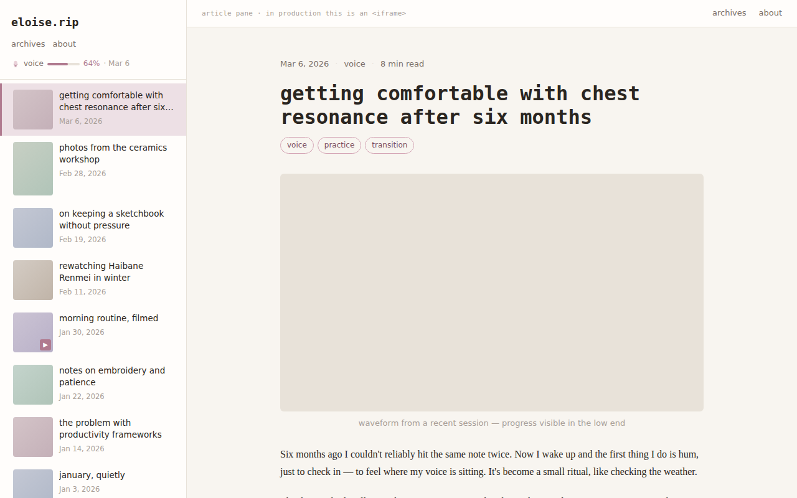
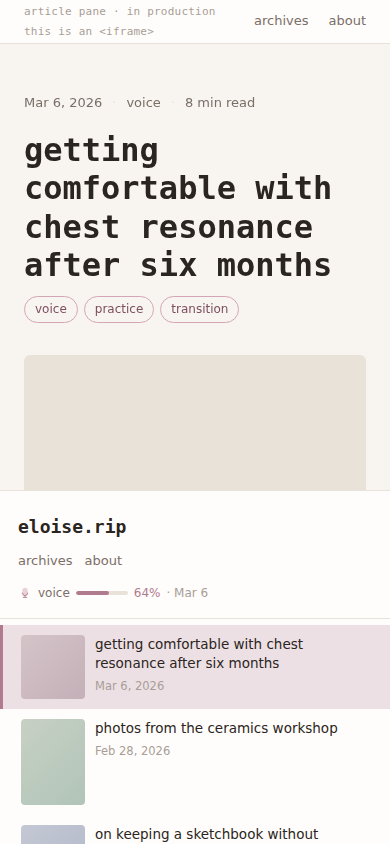

# Site Theme Planning Doc

**Status**: In progress
**Date**: 2026-03-08
**Author**: Sable [cs46]

---

## Mockup

`docs/theme-mockup.html` — open directly in a browser, no build step.

**Desktop (1280×800)**


**Mobile (390×844)**


---

## Overview

Redesign of `cute-theme` toward a **soft, minimal editorial aesthetic** — warm off-white surfaces, dusty mauve accents, serif body text, monospace headings, and a split-pane homepage that behaves like an RSS reader. Personality comes from typography and proportion, not color noise or animation.

---

## 1. Typography

### Body Text
- **Font family**: Lora (Google Fonts, serif)
- **Weight(s) used**: 400 (body), 500 (strong/bold inline)
- **Size (base)**: 16px
- **Line height**: 1.75
- **Letter spacing**: 0 (default)

### Headings (H1–H4)
- **Font family**: JetBrains Mono (Google Fonts, monospace) — distinct from body
- **Weight(s) used**: 500 (H2–H4), 600 (H1)
- **Size scale**: 1.25 ratio — H1: 2rem, H2: 1.6rem, H3: 1.28rem, H4: 1rem
- **Text transform**: none (lowercase natural, no forced caps)

### UI / Accent Sans
- Used for: nav labels, tags, badges, metadata, captions, buttons
- **Font family**: DM Sans (Google Fonts)
- **Weights used**: 400, 500, 600
- **Style notes**: slightly smaller than body (14px for meta, 13px for tags)

### Code / Monospace
- **Font family**: JetBrains Mono (same as headings — one mono font total)
- **Inline code background**: `--color-surface-raised` with `--color-border` border, 4px radius
- **Block code**: dark surface, see §6 Code Blocks

### Loading Strategy
- Google Fonts, `display=swap`
- 3 families total: Lora, JetBrains Mono, DM Sans
- Preconnect to `fonts.googleapis.com` and `fonts.gstatic.com`
- Variable fonts where available (Lora and DM Sans support variable axes)

---

## 2. Color Palette

### Base Colors
| Role | Token | Value | Notes |
|---|---|---|---|
| Page background | `--color-bg` | `#f8f5f0` | Warm off-white, slight parchment |
| Card / surface | `--color-surface` | `#fffdfb` | Near-white, slight warmth |
| Raised surface | `--color-surface-raised` | `#ffffff` | Pure white for inline code, tooltips |
| Border / divider | `--color-border` | `#e8e2d9` | Warm light tan |
| Border subtle | `--color-border-subtle` | `#f0ece5` | For very light dividers |

### Text Colors
| Role | Token | Value | Notes |
|---|---|---|---|
| Body text | `--color-text` | `#2a2520` | Warm near-black |
| Muted text | `--color-text-muted` | `#7a6e68` | Metadata, captions |
| Faint text | `--color-text-faint` | `#a89e97` | Placeholders, disabled |
| On-accent text | `--color-text-on-accent` | `#ffffff` | White on mauve buttons/badges |
| Link | `--color-link` | `#9a6478` | Darker mauve, accessible on bg |
| Link hover | `--color-link-hover` | `#b07a8f` | Accent-1 on hover |

### Accent Colors (Dusty Mauve)
| Role | Token | Value | Notes |
|---|---|---|---|
| Primary accent | `--color-accent-1` | `#b07a8f` | Links hover, CTAs, active states |
| Secondary accent | `--color-accent-2` | `#d4a5b5` | Tags, badges, decorative borders |
| Accent tint | `--color-accent-3` | `#ede0e5` | Hover backgrounds, selection |
| Accent dark | `--color-accent-dark` | `#7d4f61` | Text on light accent backgrounds |
| Success | `--color-success` | `#6a9e70` | Muted green |
| Warning | `--color-warning` | `#b07a4a` | Muted terracotta |

### Dark Mode (System `prefers-color-scheme: dark`)
| Role | Token override | Value |
|---|---|---|
| Page background | `--color-bg` | `#1c1916` |
| Card / surface | `--color-surface` | `#242018` |
| Raised surface | `--color-surface-raised` | `#2e2a25` |
| Border | `--color-border` | `#3a342c` |
| Body text | `--color-text` | `#d8d0c8` |
| Muted text | `--color-text-muted` | `#8c837a` |
| Link | `--color-link` | `#c49aaa` |

No manual toggle — system preference only.

### Gradient Usage
- **Use gradients**: No. Flat fills only. Gradients were a hallmark of the old theme; this theme avoids them entirely.
- Exception: the split pane's left/right separator may use a 1px gradient fade for a subtle vignette on scroll.

---

## 3. Material / Surface Aesthetic

### Surface Treatment
- [x] **Barely-there shadow** — cards float with a very soft drop shadow, no border.

Rationale: border-only cards feel flat and boxy. Shadow-only gives more depth without adding visual noise. Combined with the warm background, cards read as paper on a desk.

### Background
- **Main page background**: `--color-bg` solid (`#f8f5f0`), no texture
- **Texture / pattern**: None. Clean solid fill.
- **Animated background**: None. The snowfall animation does not carry forward.

### Card / Panel Style
- **Border-radius**: 8px (down from 20px in old theme)
- **Border**: none
- **Shadow**: `0 2px 12px rgba(42, 37, 32, 0.07)`
- **Shadow on hover**: `0 4px 20px rgba(42, 37, 32, 0.11)`
- **Hover animation**: `translateY(-2px)` + shadow deepens, 150ms ease-out

### Split Pane Panels
- Left pane: no shadow (sits against page bg), right edge is `1px solid --color-border`
- Right pane (iframe container): no extra border; iframe has no border

### Interactive States
- **Focus ring**: `2px solid --color-accent-2`, `outline-offset: 3px` — soft mauve, not sharp blue
- **Active / pressed**: `translateY(0)` (undoes lift), opacity 0.85

---

## 4. Layout — Desktop

### Split-Pane Homepage (Primary Layout Decision)

The homepage is a two-column split pane inspired by RSS reader UIs (Reeder, NetNewsWire):

```
┌─────────────────────┬───────────────────────────────────────────┐
│  eloise.rip         │                                           │
│  [nav links]        │   (iframe — selected article page)        │
│  ─────────────────  │                                           │
│  [thumb] Title      │                                           │
│  [thumb] Title      │                                           │
│  [thumb] Title      │                                           │
│  [thumb] Title      │                                           │
│  [thumb] Title      │                                           │
└─────────────────────┴───────────────────────────────────────────┘
```

- **Left pane width**: 300px fixed, not resizable
- **Right pane**: `flex: 1`, fills remaining viewport
- **Iframe**: `width: 100%; height: 100%; border: none;` — full pane fill
- **Default state**: iframe loads the most recent article on page load
- **URL behavior**: No `pushState`. The homepage URL stays `/`. Articles still have their own standalone pages at `/blog/{slug}.html`.
- **Left pane scroll**: independent of right pane

### Left Pane — Article List
- Each row: thumbnail (left, fixed 72×72px square, `object-fit: cover`) + title (right, DM Sans 500 14px) + date below title (DM Sans 400 12px `--color-text-muted`)
- **Aspect-adaptive**: if the article thumbnail has a portrait aspect ratio (height > width), the list item expands to show a taller thumbnail (72×96px). Detected from a `data-aspect` attribute written by the carousel_embed/thumbnail pipeline.
- Active/selected article row: left 3px border `--color-accent-1`, background `--color-accent-3`
- No hover background shift — just cursor change + subtle opacity on the thumbnail

### Left Pane — Header
- Site name: "eloise.rip" in JetBrains Mono 500 18px
- Nav links below site name: Archives · About (DM Sans 400 13px, `--color-text-muted`, space-separated)
- **Voice practice link**: displayed on its own line below nav links, styled distinctly:
  - Label: "voice" followed by a progress indicator and most recent session date
  - Format: `voice ░░░░░░░░▓▓ 64%  ·  Mar 6` (progress bar drawn with Unicode block chars or a small inline `<progress>` element)
  - Color: `--color-accent-1` for the filled portion, `--color-border` for empty, `--color-text-muted` for date
  - Links to `/voice.html`
  - Data source: TBD — needs a mechanism to compute % complete and last date (options: front-matter in voice page, a generated JSON file written by the voice upload pipeline, or a static variable in `pelicanconf.py`)
- Thin `1px solid --color-border` separator below header before article list

### Content Column (Article Pages, standalone)
- **Max-width**: 680px
- **Horizontal padding**: 24px (desktop), 16px (mobile)
- **Sidebar**: none

### Navigation (Standalone Article Pages)
- **Position**: top bar
- **Sticky**: yes
- **Style**: minimal — site name left (links to `/`), nav links right. No glass effect, no blur. Just `--color-bg` background.
- **Logo position**: left

### Article Page
- **Reading width**: 680px max
- **Metadata placement**: below title — date · category · tags on one line, `--color-text-muted` DM Sans 13px
- **Table of contents**: no
- **Related posts section**: no

### Footer
- **Height**: minimal — single line or two lines max
- **Contents**: "© eloise [year]" left, possibly a faint link to RSS right. DM Sans 12px `--color-text-faint`.

---

## 5. Layout — Mobile / Responsive

- **Breakpoints**: 768px (pane switch), 480px (further text scaling)
- **Navigation on mobile**: At ≤768px, the split pane collapses:
  - Right pane (iframe / content) on top via `order: -1`, takes `flex: 1`
  - Left pane (article list) below, `max-height: 42vh`, scrollable; `border-top` separator
  - No hamburger menu needed — nav links remain visible in left pane header
- **Article card on mobile**: same thumbnail + title layout, thumbnail stays 64×64px
- **Font size scaling**: no `vw`-based scaling. Base 16px stays; headings step down one size at 480px (H1: 1.6rem).

---

## 6. Component Specifications

### Tags & Badges
- **Shape**: pill (`border-radius: 999px`)
- **Fill**: outline — `1px solid --color-accent-2`, background transparent; hover: `--color-accent-3` fill
- **Size**: DM Sans 12px, padding `2px 10px`
- **Color**: `--color-accent-dark` text, `--color-accent-2` border

### Buttons / CTAs
- **Primary**: solid `--color-accent-1` bg, `--color-text-on-accent` text, 6px radius
- **Secondary / ghost**: transparent bg, `1px solid --color-border`, `--color-text` text
- **Hover — primary**: darken to `--color-accent-dark`, `translateY(-1px)`, 150ms
- **Hover — ghost**: border becomes `--color-accent-2`

### Code Blocks
- **Theme**: Custom — dark warm surface. Base: `#1e1a17` bg, `#d8cfc4` text. Accent tokens drawn from mauve palette.
- **Line numbers**: no
- **Copy button**: no (keep it minimal)

### Blockquotes
- **Style**: left border — `3px solid --color-accent-2`, left padding 16px, text in Lora italic, `--color-text-muted`

### Media (Images / Video Embeds)
- **Border-radius on images**: 6px
- **Caption style**: DM Sans 13px `--color-text-faint`, centered, margin-top 8px
- **Figure/video container**: no extra border or shadow; just margin

### Carousels
- **Navigation controls**: dots only (no arrows) — centered below the carousel
- **Active dot**: filled `--color-accent-1`, inactive `--color-border`

---

## 7. Iconography

### Icon Set
- **Library**: Phosphor Icons (via CDN or self-hosted SVG sprite)
- **Style**: `duotone` weight for decorative icons, `regular` for UI icons
- **Size scale**: sm=14px, md=18px, lg=24px
- **Color treatment**: inherits `currentColor` (text color); accent icons use `--color-accent-1`

### Required Icons

| Location | Purpose | Phosphor icon |
|---|---|---|
| Left pane header | Site home link (optional) | `house` |
| Left pane nav | Archives | `archive` |
| Left pane nav | About (page) | `user` |
| Left pane nav | RSS feed | `rss` |
| Article meta | Date | `calendar-blank` (duotone) |
| Article meta | Category | `folder-simple` (duotone) |
| Article meta | Tags | `tag` (duotone) |
| Article card | Video indicator | `play-circle` (solid, accent) |
| Pagination | Previous | `arrow-left` |
| Pagination | Next | `arrow-right` |
| Voice page | Play | `play` |
| Voice page | Pause | `pause` |
| Voice page | Download | `download-simple` |
| 404 page | Lost/error | `ghost` (duotone) |
| Footer | RSS | `rss` |
| Left pane header | Voice practice link | `microphone` (duotone, accent) |

No social link icons unless social URLs are added to config. No theme toggle icon (system-only dark mode).

---

## 8. Motion & Animation

- **`prefers-reduced-motion` respected**: yes — all transitions wrapped or stripped under `@media (prefers-reduced-motion: reduce)`
- **Default transition duration**: 150ms
- **Easing curve**: `ease-out`
- **Hover animations**: `translateY(-2px)` on cards, opacity shift on article list rows. No scale, no glow, no color-pulse.
- **Page load animations**: none
- **Background animation**: none (snowfall dropped)
- **Pane transitions**: iframe `src` change is instantaneous (no fade). Left pane scroll is native momentum.

---

## 9. Design Inspirations

| URL | What to borrow |
|---|---|
| _(add later)_ | |
| _(add later)_ | |
| _(add later)_ | |

### Mood / Keywords

- quiet
- editorial
- warm
- readable
- precise
- unhurried

### What to Keep from Current Theme

- [x] Card hover lift effect (kept, toned down to 2px)
- [ ] Frosted-glass nav — **dropped**
- [ ] Snowfall background — **dropped**
- [ ] 20px border-radius everywhere — **dropped** (now 6–8px)
- [x] Character stats page — keep structure, re-skin to new palette
- [ ] Press Start 2P accent font — **dropped**
- [x] Carousel component — keep functionality, restyle controls

### What to Drop

- Hot pink `#ff6b9d` + bright gradient buttons
- Snowfall CSS animation
- Emoji substitutes for metadata icons (`📅 📂 🏷️`)
- 20px border-radius on all elements
- `Press Start 2P` font

---

## 10. Decisions Log

| Date | Element | Decision | Rationale |
|---|---|---|---|
| 2026-03-08 | Overall aesthetic | Soft & minimal | Moving away from cute/playful toward editorial |
| 2026-03-08 | Body font | Lora (serif) | Warm, readable, works at 16px for long-form |
| 2026-03-08 | UI font | DM Sans | Clean, friendly, distinct from body serif |
| 2026-03-08 | Heading font | JetBrains Mono | Mono headings give quiet code/journal feel |
| 2026-03-08 | Base palette | Warm off-white (#f8f5f0) | Softer on eyes than pure white |
| 2026-03-08 | Accent palette | Dusty mauve (#b07a8f) | Soft, not loud; complements warm neutrals |
| 2026-03-08 | Dark mode | System preference only | No toggle; simpler; respects OS preference |
| 2026-03-08 | Surface | Barely-there shadow | No border; cards float softly |
| 2026-03-08 | Homepage layout | Split pane (list + iframe) | RSS reader UX; list left, article right |
| 2026-03-08 | URL behavior | No pushState | Homepage stays `/`; articles have own pages |
| 2026-03-08 | Mobile layout | Stacked (content top, list bottom) | Content visible immediately; list scrolls below |
| 2026-03-08 | Card aspect-adapt | Landscape/portrait thumbnail rows | Card height adapts to image aspect ratio |
| 2026-03-08 | Icons | Phosphor (duotone + regular) | Expressive but minimal; duotone adds depth |
| 2026-03-08 | Motion | Very subtle — 150ms opacity/translate | Matches minimal aesthetic; near-invisible |
| 2026-03-08 | Gradients | None | Explicitly dropped from old theme |
| 2026-03-08 | Border-radius | 8px cards, 6px images, 999px pills | Much less rounded than old 20px default |
| 2026-03-08 | Voice practice link | % complete + last date in left pane header | Persistent visibility; tracks practice habit at a glance |

---

## Implementation Notes

Once all decisions above are final, build in this order:

1. **CSS custom properties** — all color tokens, typography scale, spacing
2. **Split-pane shell** — left/right layout, iframe container, viewport height handling
3. **Left pane** — site header, nav links, article list items (thumb + title + date)
4. **Article list interaction** — click handler sets iframe `src`, highlights active row
5. **Right pane / iframe** — default load on page open
6. **Standalone article page layout** — top nav, reading column, footer
7. **Article page typography** — Lora body, JetBrains Mono headings, DM Sans meta
8. **Tags, badges, buttons**
9. **Code blocks** — custom dark warm theme
10. **Media: images, video embeds, carousels**
11. **Phosphor icon integration**
12. **Dark mode** — CSS variable overrides under `@media (prefers-color-scheme: dark)`
13. **Mobile responsive pass** — pane stacking at 768px, font scaling at 480px
14. **Character stats page re-skin** — swap palette variables
15. **Validate output** — `python validate_output.py`
